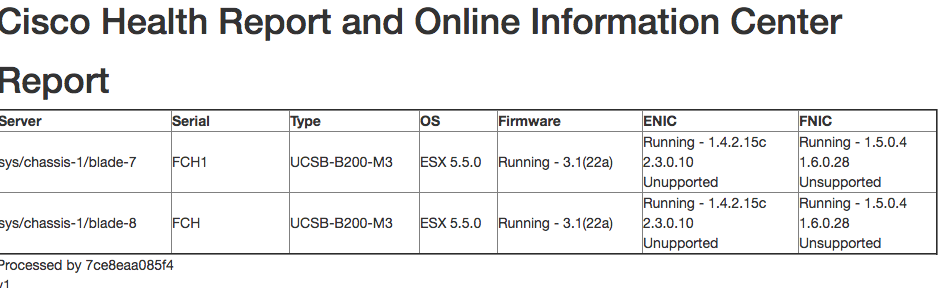

# CHROnIC UCS ESX Analyzer (UEA)

Cisco Health Reports and Online Information Center is a plug-able web app to help visualize and maintain device's support by providing various health reports.

CHROnIC UCS ESX Analyzer uses information collected from CHROnIC Collector to determine if a UCS system is in compliance with Cisco's HCL

## Example Report


# Installation

CHROnIC UCS ESX Analyzer is built in Python 3.5 and is packaged with a Dockerfile for easy builds and deployments

## Environment

CHROnIC UCS ESX Analyzer expects the following environment variables to be set:

CHRONICBUS needs to point to the CHROnIC Bus instance's base URL
```
CHRONICBUS
```

HCL needs to point to one of Cisco's HCL tool URL's.  ex: http://ucshcltool.cloudapps.cisco.com/public/rest
```
HCL
```


## Downloading

```
docker pull chapeter/chronic-ucs-esx-analyzer
```

# Usage

```
docker run -d -e "CHRONICBUS=<url>" -e "HCL=<url>" chapeter/chronic-ucs-esx-analyzer
```

# Compatibility

Currently CHROnIC UCS ESX Analyzer needs some manual translations to be setup to work between UCS and the Cisco HCL tool.  These bindings live in a TinyDB file of piddb.json .  Items can be added at anytime by editing that database

Supported Servers:
* UCS B200 M3

Supported CPU's:
* E5-2600 v1
* E5-2600 v2

Supported Adapters:
* VIC 1240

Supported OS:
* VMware ESX (unknown if update versions run correctly)
